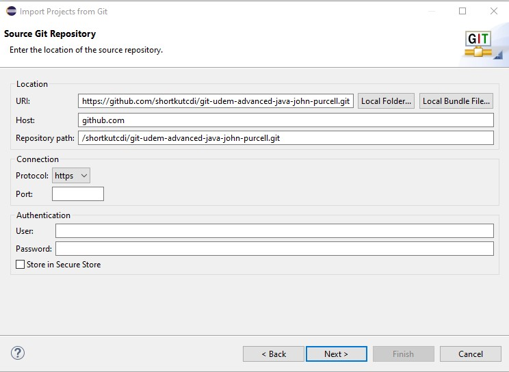
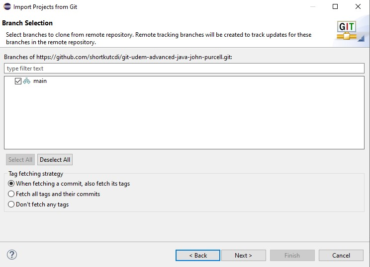
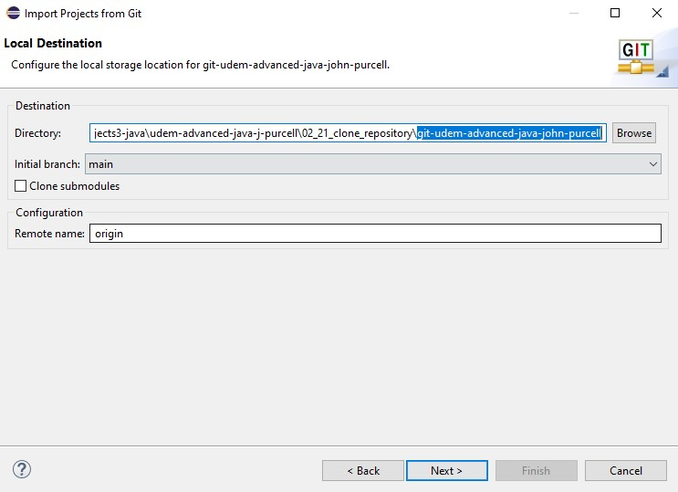

# Cloning repositories in eclipse

Dans github copier l'url du repository à cloner / clone with https

par exemple :

https://github.com/shortkutcdi/git-udem-advanced-java-john-purcell.git

Dans eclipse file/import/ git/ Projects from Git => next / clone URI

1 - clone from repository

2-

3-

